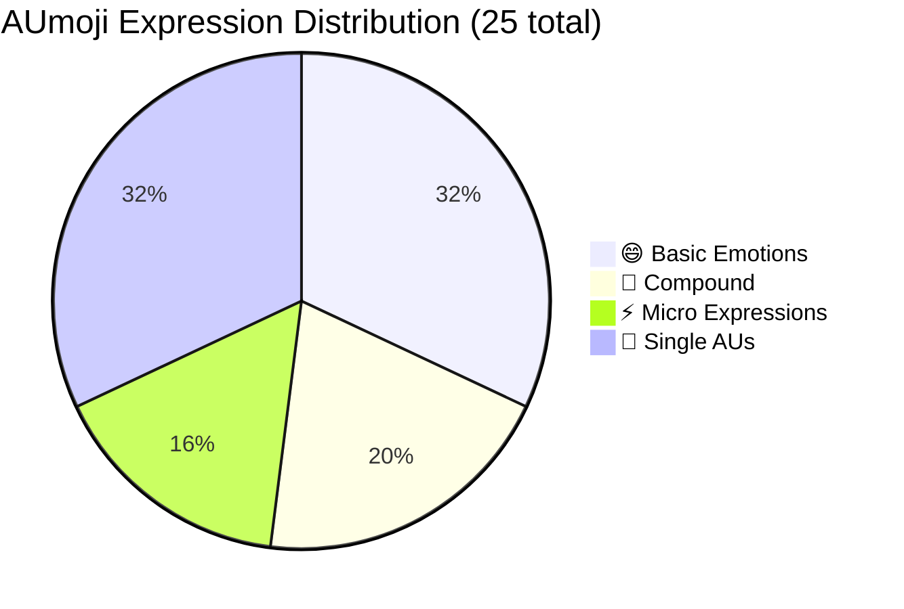
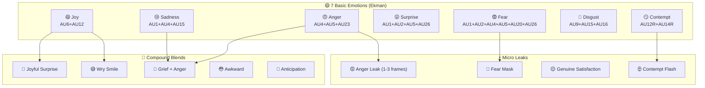

<div align="center">

```
 █████╗ ██╗   ██╗███╗   ███╗ ██████╗      ██╗██╗
██╔══██╗██║   ██║████╗ ████║██╔═══██╗     ██║██║
███████║██║   ██║██╔████╔██║██║   ██║     ██║██║
██╔══██║██║   ██║██║╚██╔╝██║██║   ██║██   ██║██║
██║  ██║╚██████╔╝██║ ╚═╝ ██║╚██████╔╝╚█████╔╝██║
╚═╝  ╚═╝ ╚═════╝ ╚═╝     ╚═╝ ╚═════╝  ╚════╝ ╚═╝
```

**影视级 FACS 面部动作编码表情选择器 · Vue 3**

*Cinematic FACS Action Unit Expression Picker for Vue 3*

[](LICENSE)
[](https://vuejs.org)
[](https://pnpm.io)
[]()
[]()

[🌐 Live Demo](https://aumoji.pages.dev) · [📦 NPM](https://www.npmjs.com/package/aumoji-picker) · [📖 Docs](https://aumoji.pages.dev/docs)

</div>

---

## 🎭 What is AUmoji?

AUmoji 是一个基于 **FACS（面部动作编码系统）** 标准构建的 Vue 3 表情选择器组件，专为 **AI 视频创作、数字人制作和影视提示词工程**设计。

每个表情都对应精确的 AU 编号（Action Unit Code）以及可直接用于 Stable Diffusion、Midjourney、Kling 等 AI 生成工具的提示词。

> AUmoji is a Vue 3 expression picker built on the FACS standard — giving AI video creators, digital human engineers, and cinematographers a precise facial action vocabulary with ready-to-use AI prompts.

---

## 📊 Expression Coverage

### Distribution by Category

```
Expression Coverage (25 total)
━━━━━━━━━━━━━━━━━━━━━━━━━━━━━━━━━━━━━━━━━━━━━━━━━━━━━━
😄 Basic Emotions     ████████████████░░░░░░░░░  8 / 32%
🤩 Compound           ██████████░░░░░░░░░░░░░░░  5 / 20%
⚡ Micro Expressions  ████████░░░░░░░░░░░░░░░░░  4 / 16%
🔬 Single AUs         ████████████████░░░░░░░░░  8 / 32%
━━━━━━━━━━━━━━━━━━━━━━━━━━━━━━━━━━━━━━━━━━━━━━━━━━━━━━
                                              Total: 25
```



### AU Code Complexity Heatmap

```
AU Usage Frequency Across All 25 Expressions
─────────────────────────────────────────────────────────────────
AU1  ██████████  (used in: Sadness, Surprise, Fear, Anger Leak,
                  Fear Mask, Inner Brow Raise, Joyful Surprise,
                  Grief+Anger, Anticipation)                  ×9
AU2  ████████    (Surprise, Fear, Fear Mask, Outer Brow Raise,
                  Joyful Surprise, Anticipation)              ×6
AU4  ████████    (Anger, Fear, Brow Lowerer, Wry Smile,
                  Anger Leak, Grief+Anger, Awkward)           ×7
AU5  █████       (Anger, Surprise, Fear, Upper Lid Raise)     ×4
AU6  █████       (Genuine Smile, Genuine Satisfaction,
                  Cheek Raiser, Joyful Surprise, Wry Smile)   ×5
AU12 ████████    (Genuine Smile, Social Smile, Lip Corner Pull,
                  Joyful Surprise, Wry Smile, Awkward,
                  Anticipation)                               ×7
AU15 ████        (Sadness, Disgust, Lip Corner Depress,
                  Grief+Anger)                                ×4
AU26 ████        (Surprise, Fear, Jaw Drop, Joyful Surprise)  ×4
─────────────────────────────────────────────────────────────────
Most used: AU1 / AU4 / AU12 — foundational building blocks
```

### Emotion Wheel Coverage



---

## 📋 Complete AU Reference Table

### 😄 Basic Emotions

| Emoji | Name | AU Code | Muscles | Strength | Scene |
|:---:|:---|:---:|:---|:---:|:---|
| 😄 | Genuine Smile / 真笑 | `AU6+AU12` | Orbicularis oculi + Zygomaticus major | 3-4 | Cinematic / Digital Human |
| 🙂 | Social Smile / 假笑 | `AU12` | Zygomaticus major (isolated) | 2 | Business / PR |
| 😢 | Sadness / 悲伤 | `AU1+AU4+AU15` | Frontalis + Corrugator + Dep. anguli | 3 | Drama / Emotion |
| 😠 | Anger / 愤怒 | `AU4+AU5+AU23` | Corrugator + Levator palp. + Orbicularis | 4 | Conflict / Climax |
| 😲 | Surprise / 惊讶 | `AU1+AU2+AU5+AU26` | Frontalis + Levator palp. + Mandible | 3-4 | Plot Twist |
| 😨 | Fear / 恐惧 | `AU1+AU2+AU4+AU5+AU20+AU26` | Full fear compound | 4-5 | Horror / Tension |
| 🤢 | Disgust / 厌恶 | `AU9+AU15+AU16` | Levator labii + Dep. anguli + Dep. labii | 3 | Negative / Conflict |
| 😏 | Contempt / 轻蔑 | `AU12R+AU14R` | Zygomaticus major (R) + Buccinator (R) | 2 | Villain / Power |

### 🤩 Compound Expressions

| Emoji | Name | AU Code | Base Emotions | Scene |
|:---:|:---|:---:|:---|:---|
| 🤩 | Joyful Surprise / 惊喜 | `AU1+AU2+AU6+AU12+AU26` | Joy × Surprise | Award / Gift Reveal |
| 😤 | Grief & Anger / 悲愤 | `AU1+AU4+AU15+AU23` | Sadness × Anger | Emotional Peak |
| 😅 | Wry Smile / 苦笑 | `AU6+AU12+AU4` | Joy × Mild Anger | Dark Humor / Irony |
| 😳 | Awkward / 尴尬 | `AU12+AU20+AU4` | Social Smile × Discomfort | Social Anxiety |
| 🤗 | Anticipation / 期待 | `AU1+AU2+AU12` | Surprise × Joy | Hopeful / Waiting |

### ⚡ Micro Expressions (1-3 frames)

| Emoji | Name | AU Code | Duration | Detection Context |
|:---:|:---|:---:|:---:|:---|
| 😡 | Anger Leak / 愤怒泄露 | `AU4+AU5` | 1-3 frames | Lie detection / Suppressed emotion |
| 😬 | Fear Mask / 恐惧掩饰 | `AU1+AU2+AU20` | 1-3 frames | Thriller / Deception scene |
| 😌 | Genuine Satisfaction / 真实满足 | `AU6` | 2-4 frames | Duchenne marker / Hidden joy |
| 🙄 | Contempt Flash / 轻蔑闪现 | `AU12R` | 1-2 frames | Negotiation / Power dynamics |

### 🔬 Single Action Units

| Emoji | AU Code | Name | Muscle | Conflict |
|:---:|:---:|:---|:---|:---|
| 🤨 | `AU1` | Inner Brow Raise / 内侧眉上提 | Frontalis (medial) | Partial conflict with AU4 |
| 🙄 | `AU2` | Outer Brow Raise / 外侧眉上提 | Frontalis (lateral) | — |
| 🤔 | `AU4` | Brow Lowerer / 皱眉 | Corrugator supercilii | Conflicts with AU1/AU2 |
| 😯 | `AU5` | Upper Lid Raise / 上眼睑上提 | Levator palpebrae | — |
| 😊 | `AU6` | Cheek Raiser / 颊部上提 | Orbicularis oculi (orbital) | — |
| 😊 | `AU12` | Lip Corner Pull / 嘴角上扬 | Zygomaticus major | Antagonist to AU15 |
| 🙁 | `AU15` | Lip Corner Depress / 嘴角下拉 | Depressor anguli oris | Antagonist to AU12 |
| 😮 | `AU26` | Jaw Drop / 下颌下降 | Masseter relax + Mandible depressor | — |

---

## 🏗️ Monorepo Architecture

```
aumoji/                           ← Monorepo root (pnpm workspace)
├── packages/
│   └── aumoji-picker/            ← 📦 Vue 3 component package
│       ├── src/
│       │   ├── AUmojiPicker.vue  ←   Main component
│       │   ├── index.js          ←   Public API exports
│       │   └── constants/
│       │       └── auData.js     ←   Local data source
│       └── package.json
└── apps/
    └── website/                  ← 🌐 Documentation website
        ├── src/
   │   ├── data/             ←   Local data source
   │   ├── pages/            ←   Home / Docs / Playground
        │   └── composables/      ←   useTheme / useLang (global state)
   └── package.json          ←   depends on aumoji-picker
```

**Data flow:**
```
aumoji-picker/src/constants/auData.js  (picker local source)
  │
  └──► User's app: import { AUmojiPicker, AU_DATA } from 'aumoji-picker'

apps/aumoji-website/src/data/auData.js  (website local source)
```

---

## 🚀 Quick Start

### Install

```bash
# npm
npm install aumoji-picker

# pnpm
pnpm add aumoji-picker

# yarn
yarn add aumoji-picker
```

### Basic Usage

```vue
<script setup>
import { AUmojiPicker } from 'aumoji-picker'
import 'aumoji-picker/dist/style.css'

function onSelect(item) {
  console.log(item.auCode)   // e.g. "AU6+AU12"
  console.log(item.promptEn) // AI prompt string
}
</script>

<template>
  <AUmojiPicker
    theme="dark"
    lang="zh"
    :width="350"
    :height="450"
    @select="onSelect"
  />
</template>
```

### Access Raw Data

```js
// Full data access (for custom UI, search, etc.)
import { AU_DATA, CATEGORIES } from 'aumoji-picker'

const allExpressions = Object.values(AU_DATA).flat()  // 25 items
const basicCount = AU_DATA.basic.length               // 8
```

---

## ⚙️ Component Props

| Prop | Type | Default | Description |
|:---|:---|:---:|:---|
| `theme` | `'dark' \| 'light' \| 'auto'` | `'dark'` | Color theme. `auto` follows system preference |
| `lang` | `'zh' \| 'en'` | `'zh'` | UI language |
| `width` | `Number` | `350` | Component width in px |
| `height` | `Number` | `450` | Component height in px |
| `defaultCategory` | `'basic' \| 'compound' \| 'micro' \| 'single'` | `'basic'` | Initially active category |
| `showSearch` | `Boolean` | `true` | Show/hide the search bar |
| `copyFormat` | `'auCode' \| 'prompt' \| 'none'` | `'auCode'` | What gets copied on card click |

## 📡 Events

| Event | Payload | Description |
|:---|:---|:---|
| `@select` | `AUItem` | Fired when user clicks an expression card |

### `AUItem` Shape

```ts
interface AUItem {
  id: string           // e.g. "basic_001"
  auCode: string       // e.g. "AU6+AU12"
  name: string         // Chinese name (alias for nameCn)
  nameCn: string       // "真笑(自然)"
  nameEn: string       // "Genuine Smile"
  emoji: string        // "😄"
  category: string     // "basic" | "compound" | "micro" | "single"
  desc: string         // Chinese description (alias for descCn)
  descCn: string
  descEn: string
  prompt: string       // AI prompt (alias for promptCn)
  promptCn: string     // Chinese AI prompt
  promptEn: string     // English AI prompt
  strength?: string    // FACS intensity level e.g. "3-4级"
  muscle?: string      // Primary muscle groups
  scene?: string       // Recommended use scenarios
  isMicro: boolean     // Whether it's a micro expression
  conflict?: string    // AU antagonist relationships
}
```

---

## 🌍 i18n Support

```vue
<!-- Switch language reactively — no page reload -->
<AUmojiPicker lang="zh" />   <!-- 中文界面 -->
<AUmojiPicker lang="en" />   <!-- English UI -->
```

All 25 expressions include bilingual fields:
- `nameCn` / `nameEn`
- `descCn` / `descEn`
- `promptCn` / `promptEn`

---

## 🎨 Theming

```vue
<!-- Built-in themes -->
<AUmojiPicker theme="dark" />   <!-- Default dark -->
<AUmojiPicker theme="light" />  <!-- Light mode -->
<AUmojiPicker theme="auto" />   <!-- Follows prefers-color-scheme -->
```

Custom CSS tokens (override in your `:root`):

```css
.aup[data-theme="dark"] {
  --aup-bg: #09090f;
  --aup-card: rgba(255, 255, 255, 0.04);
  --aup-ac: #7c3aed;
  --aup-tx: #f1f5f9;
}
```

---

## 📐 FACS Background

The **Facial Action Coding System (FACS)** was developed by Paul Ekman & Wallace Friesen (1978). It decomposes all facial movements into 44 **Action Units (AUs)** mapped to specific facial muscles.

```
FACS AU System
─────────────
AU1   Inner Brow Raise    →  Frontalis (medial)
AU2   Outer Brow Raise    →  Frontalis (lateral)
AU4   Brow Lowerer        →  Corrugator supercilii
AU5   Upper Lid Raiser    →  Levator palpebrae
AU6   Cheek Raiser        →  Orbicularis oculi
AU9   Nose Wrinkler       →  Levator labii alaeque nasi
AU12  Lip Corner Puller   →  Zygomaticus major
AU14  Dimpler             →  Buccinator
AU15  Lip Corner Depress  →  Depressor anguli oris
AU16  Lower Lip Depress   →  Depressor labii
AU20  Lip Stretcher       →  Risorius & platysma
AU23  Lip Tightener       →  Orbicularis oris
AU26  Jaw Drop            →  Masseter relaxation
```

AUmoji covers the **most cinematically significant** subset used in:
- AI image/video generation (Stable Diffusion, Midjourney, Kling, Wan)
- Digital human animation (MetaHuman, ReadyPlayerMe)
- Lie detection & behavioral analysis training data

---

## 🗂️ Package Structure

```
packages/aumoji-picker/   ← Vue 3 UI component
                              <AUmojiPicker> SFC
                              search, category nav, copy-on-click
                              dark/light/auto theme
                              zh/en i18n

apps/website/             ← Documentation site
                              Home, Docs, Playground pages
                              global theme & lang toggle
                              built with Vite + Tailwind v4
```

---

## 🛠️ Development

```bash
# Clone
git clone https://github.com/Geekmister/AUmoji.git
cd AUmoji

# Install deps (pnpm workspace)
pnpm install

# Start website dev server (http://localhost:3000)
pnpm dev

# Build picker library
pnpm build:picker

# Build website
pnpm build:website
```

### Workspace Commands

```bash
pnpm dev            # Start website (apps/website)
pnpm dev:picker     # Start picker dev mode
pnpm build          # Build picker → then website
pnpm build:picker   # Build picker only
pnpm build:website  # Build website only
```

---

## 📄 License

MIT © 2025 [Geekmister](https://github.com/Geekmister)

---

<div align="center">

**Built with ❤️ for AI creators, digital human engineers & film makers**

*FACS · Vue 3 · Zero Dependencies · Open Source*

</div>

